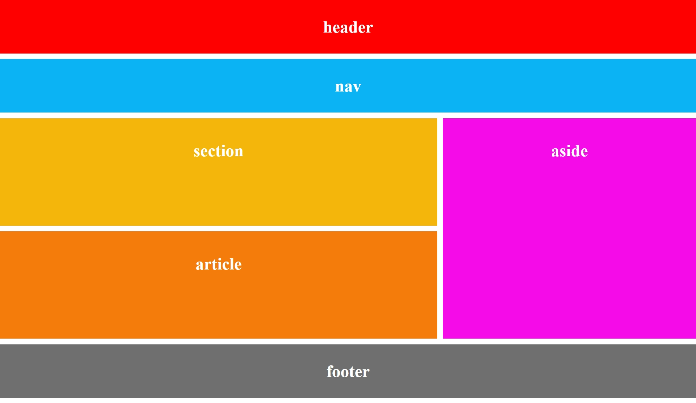

# Blog Layout by Shon

A simple responsive blog layout built using **HTML5** and **CSS Grid**.

## 📌 Project Overview

This project demonstrates the use of:

- Semantic HTML elements
- CSS Grid Layout
- Basic page structure design
- Styling with CSS
- Layout organization for a blog/webpage

---

## output


## 🏗 Layout Structure

The webpage consists of the following sections:

- **Header**
- **Navigation Bar**
- **Section**
- **Aside**
- **Article**
- **Footer**

### Layout Representation

```text
+---------------------------+
|          HEADER           |
+---------------------------+

+---------------------------+
|            NAV            |
+---------------------------+

+---------------+-----------+
|               |           |
|   SECTION     |   ASIDE   |
|               |           |
+---------------+           |
|               |           |
|   ARTICLE     |           |
|               |           |
+---------------+-----------+

+---------------------------+
|          FOOTER           |
+---------------------------+
```

---

## 📂 Project Structure

```text
Blog-Layout/
│
├── index.html
├── style.css
└── README.md
```

---

## 🚀 Technologies Used

- HTML5
- CSS3
- CSS Grid

---


## ⚙ Features

✔ Semantic HTML Tags

✔ CSS Grid Layout

✔ Clean and Organized Structure

✔ Easy to Customize

✔ Beginner-Friendly Project

---

## 📖 HTML Semantic Tags Used

```html
<header>
<nav>
<section>
<aside>
<article>
<footer>
```

These tags improve:

- Readability
- Accessibility
- SEO

---

## 📌 CSS Concepts Used

### CSS Grid

```css
.container{
    display:grid;
    grid-template-columns:auto auto auto;
    gap:10px;
}
```

### Grid Spanning

```css
.item1{
    grid-column: span 2;
}

.item2{
    grid-row: span 2;
}
```


## 🧑‍💻 Author

**Shon Latheef**

BCA Student  
Christ (Deemed to be University)

---

## 📄 License

This project is for learning and educational purposes.