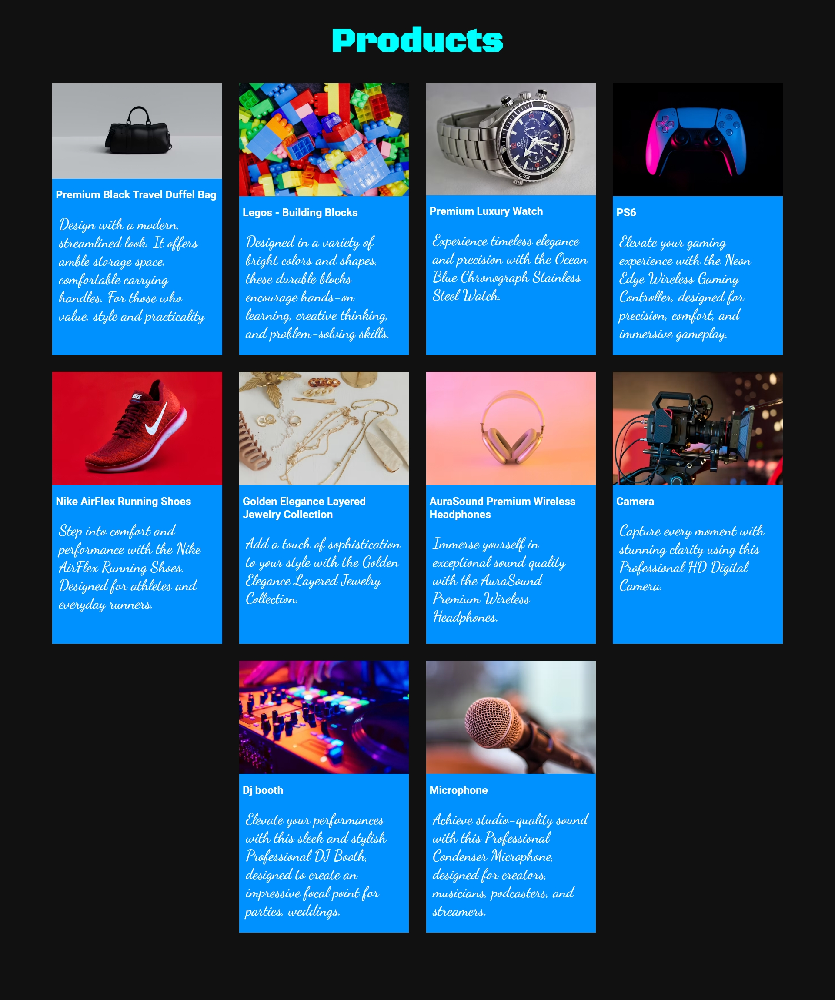

# 🛍️ Product Catalog

A modern and responsive **Product Catalog Webpage** built using **HTML5** and **CSS3**.

This project displays products in a card-based layout, showcasing images, titles, and descriptions in an organized and visually appealing manner.

---

## 📌 Features

- Responsive card layout
- Product images with descriptions
- Clean and minimal UI
- Semantic HTML structure
- Easy to customize and extend
- Beginner-friendly project

---

## output


## 🚀 Technologies Used

- HTML5
- CSS3
- Flexbox / Grid (depending on CSS implementation)
- Responsive Design Principles

---

## 📂 Project Structure

```text
Product-Catalog/
│
├── index.html
├── style.css
└── README.md
```

---


## 📖 HTML Structure

```html
<body>

<h1>Products</h1>

<section>

<div class="card">
    
    <h4>
    <p>
</div>

</section>

</body>
```

Each card contains:

- Product Image
- Product Title
- Product Description

---

## 🔮 Future Improvements

- Search functionality
- Category filtering
- Add to Cart button
- Product ratings
- Price display
- Dark mode support
- API integration

---

## 👨‍💻 Author

### Shon Latheef

BCA Student  
Christ (Deemed to be University)

---

## 📄 License

This project is created for educational and learning purposes.

Feel free to modify and enhance it.

---
