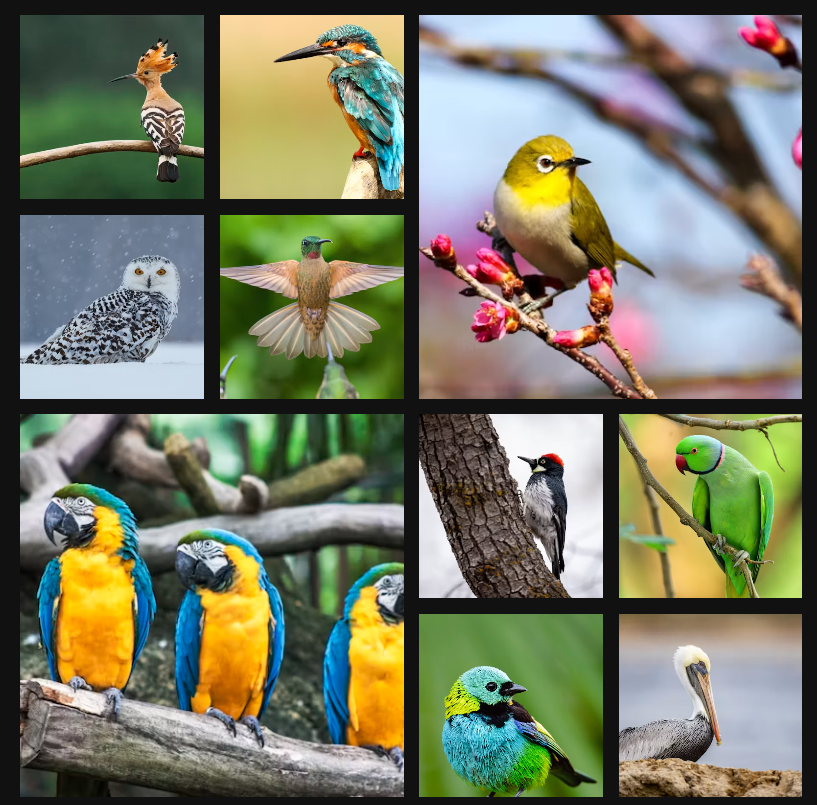

# 📸 Photo Gallery

A responsive photo gallery built using **HTML5** and **CSS Grid Layout**. The gallery displays a collection of bird photographs in an attractive masonry-style arrangement with selected images spanning multiple rows and columns.

## ✨ Features

- Responsive CSS Grid layout
- Masonry-inspired gallery design
- Large featured images using grid spanning
- Clean and minimal dark theme
- Fully image-based gallery
- Uses high-quality images from Unsplash

## output 


## 🛠 Technologies Used

- HTML5
- CSS3
- CSS Grid
- Unsplash Images

## 📂 Project Structure

```text
Photo-Gallery/
│
├── index.html
├── style.css
└── README.md
```

## 🎨 Layout Details

The gallery uses a **4-column CSS Grid** layout.

```css
.container {
  display: grid;
  grid-template-columns: auto auto auto auto;
  gap: 10px;
}
```

Some images are highlighted by spanning multiple rows and columns.

```css
.box3,
.box6 {
  grid-column: span 2;
  grid-row: span 2;
}
```

Images automatically fill their containers while preserving visual quality.

```css
.box img {
  width: 100%;
  height: 100%;
  object-fit: cover;
}
```

## 📄 License

This project is available for educational and personal use.

---

Made with ❤️ using HTML and CSS.
